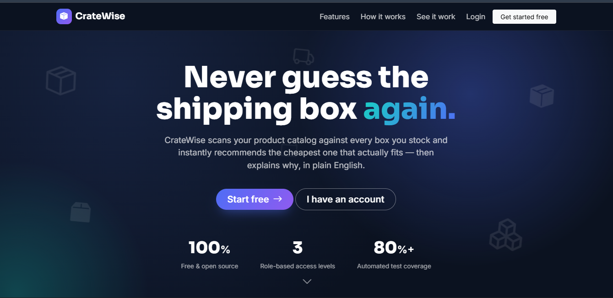
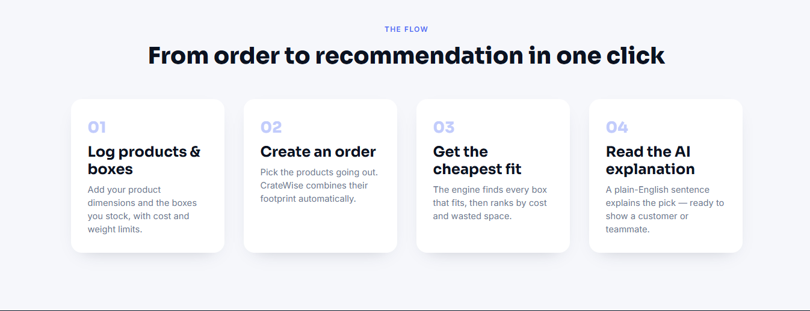
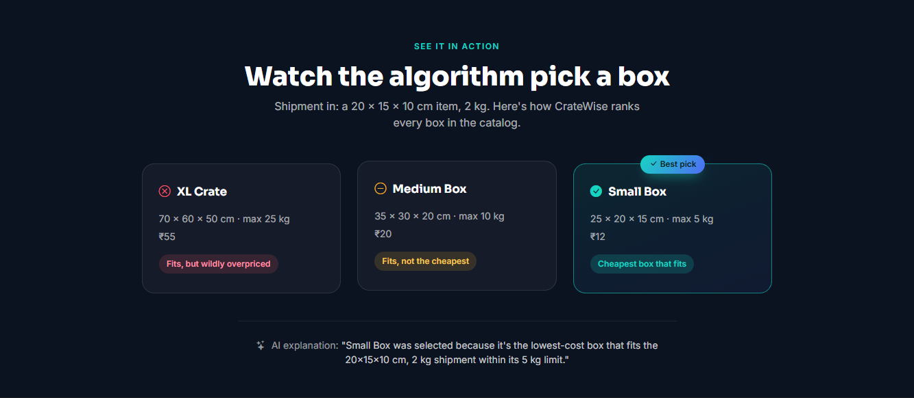
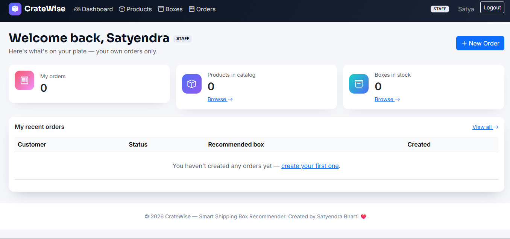
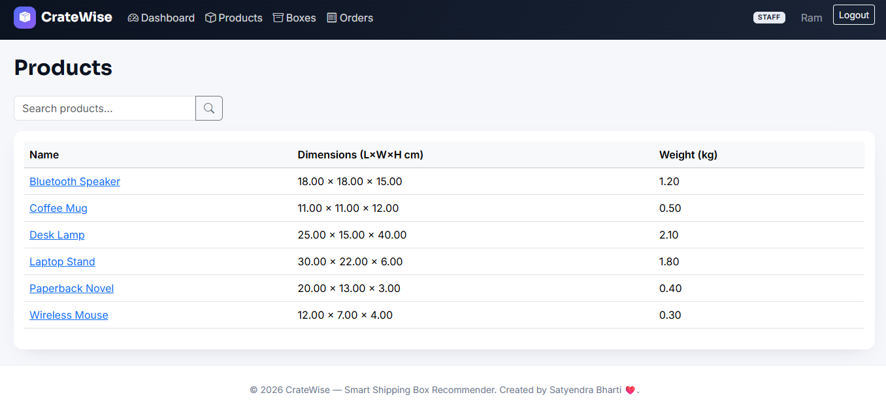
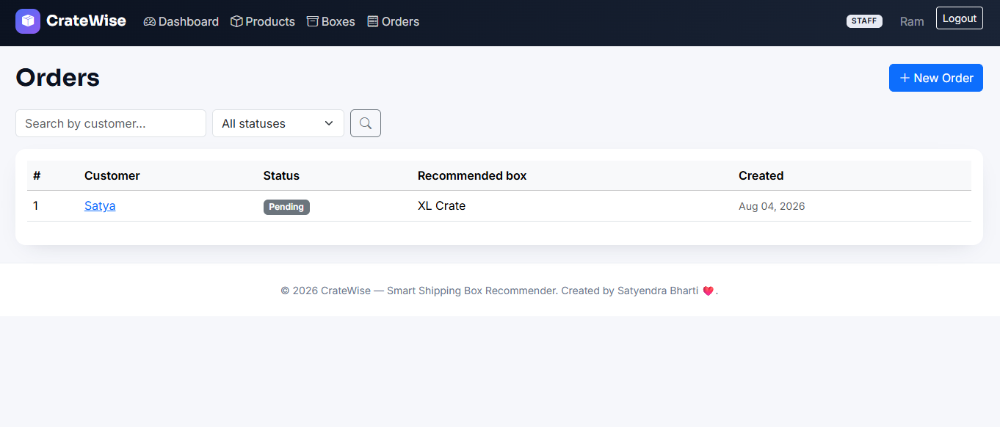

# CrateWise — Warehouse Box Recommender

Never guess the shipping box again. CrateWise scans an order's products
against every box in stock and recommends the cheapest one that actually
fits — then explains why, in plain English.

🔗 **Live demo:** https://cratewise.onrender.com/
🔗 **Repo:** https://github.com/Cipher-bhai/CreateWise_Warehouse_Box_Recommender



## Features

- **Smart box recommendation** — the cheapest box that fits an order's
  dimensions and weight, picked automatically on order creation.
- **Plain-English AI explanation** — every recommendation comes with a
  one-line reason why (Google Gemini, free tier; falls back to a
  rule-based sentence if no API key is set, so it always works).
- **Role-based access** — Admin, Manager, and Staff each get their own
  dashboard and permissions.
- **Full CRUD** for Products, Boxes, and Orders, with search and pagination.
- **Auth** — signup, login, logout, and email-based password reset.
- **REST API** mirroring the same permissions as the web UI.
- **36 automated tests, 84% coverage.**

## How it works



1. Log your products and the boxes you stock, with cost and weight limits.
2. Create an order — CrateWise combines the products' footprint automatically.
3. It ranks every box that fits by cost and picks the cheapest.
4. You get a plain-English explanation, ready to show a customer or teammate.



## Screenshots

| Staff dashboard | Products | Orders |
|---|---|---|
|  |  |  |

## Roles

| Role | Can do |
|---|---|
| **Admin** | Everything, plus manage other users |
| **Manager** | Manage Products, Boxes, and all Orders |
| **Staff** | Create orders, view only their own; read-only on Products/Boxes |

New signups always start as Staff — an Admin promotes accounts afterwards.

## Tech stack

Django 5 · Django REST Framework · Bootstrap 5 · Chart.js · SQLite (dev) ·
WhiteNoise · python-decouple · Google Gemini (optional, free tier)

## Setup

```bash
python -m venv venv
source venv/bin/activate        # venv\Scripts\activate on Windows
pip install -r requirements.txt

cp .env.example .env             # optionally add GEMINI_API_KEY

python manage.py migrate
python manage.py seed_data       # sample products, boxes, and 3 demo users
python manage.py runserver
```

Visit `http://127.0.0.1:8000/`.

### Demo accounts (created by `seed_data`)

| Username | Password | Role |
|---|---|---|
| `demo_admin` | `ChangeMe123!` | Admin |
| `demo_manager` | `ChangeMe123!` | Manager |
| `demo_staff` | `ChangeMe123!` | Staff |

### AI explanations (optional)

Get a free key at https://aistudio.google.com/app/apikey, add it to `.env`
as `GEMINI_API_KEY=...`, restart the server. Without a key, recommendations
still work — they just get a rule-based explanation instead of an
AI-generated one.

## Running tests

```bash
coverage run manage.py test
coverage report -m --omit="venv/*,manage.py,*/migrations/*,*/tests/*"
```

36 tests, 84% coverage. See `TEST_OUTPUT.md` for a real captured run, or
check `.github/workflows/tests.yml` for CI.

## Project structure

```
warehouse/     # settings, urls
accounts/      # custom User model (roles), auth, permission mixins
core/          # Product/Box/Order models, recommendation algorithm,
               # AI explanation service, CRUD views, REST API, tests
templates/     # landing, auth, dashboards, CRUD pages
docs/screenshots/
```

## Design notes

- The recommendation algorithm uses a **bounding-box approximation**
  (largest single item dimension + total weight) rather than true
  multi-item 3D bin-packing, which is NP-hard and out of scope here.
- Items must fit in their given orientation — no rotation search.
- The AI explanation is **additive, never load-bearing**: a failed or
  missing Gemini call falls back silently to a rule-based sentence,
  so order creation never breaks because of it.
- Staff can create orders but not edit or delete them — Admin/Manager
  can still correct mistakes.

## Deployment

Deployed on [Render](https://render.com) (free tier):
- Build: `pip install -r requirements.txt && python manage.py collectstatic --noinput`
- Start: `gunicorn warehouse.wsgi:application`
- Env vars: `SECRET_KEY`, `DEBUG=False`, `GEMINI_API_KEY` (optional)

---

© 2026 CrateWise — Smart Shipping Box Recommender. Created by Satyendra Bharti.
